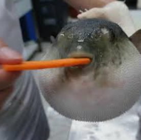

<h1 align="center">Puff Search</h1>

<p align="center">
  
</p>

<p align="center">
  A clean, customizable web hub with apps, a fast browser, extensive customization options, and more.
</p>
 
<hr>

## Roadmap

* [x] Apps
* [x] Proxy
* [x] Movies
* [x] Chatroom

## Deployment

Puff Search serves its static files and proxy backends from the same Node.js service. Scramjet derives its Wisp WebSocket URL from the page's current origin, so an HTTPS deployment automatically connects to `wss://your-domain/wisp/`.

### Deploy on Botkeep

Deploy this repository as a Docker service using the included `Dockerfile`, not as a static site. Configure the service to listen on container port `8000` (or pass the port assigned by the platform through `PORT` or `SERVER_PORT`), then attach `botkeep.cloud` and enable HTTPS.

The platform's router must send both normal HTTP requests and WebSocket upgrade requests to this same service. In particular, it must preserve the `/wisp/` path and forward WebSocket upgrades for it. TLS can terminate at the platform; the connection from the browser must still be `wss://botkeep.cloud/wisp/`. Do not add a path prefix unless the app's root paths and proxy configuration are updated to match.

DNS, TLS certificates, and WebSocket forwarding are configured in the hosting provider and cannot be enabled by repository changes alone.

Follow the steps below to deploy.

### Run Locally

Clone the repository:

```sh
git clone https://github.com/pufferfishlovegrapes-create/puffsearch.git
```

Enter the directory:

```sh
cd puffsearch
```

Install dependencies and run the site with its same-origin Wisp endpoint:

```sh
npm install
npm start
```

The server listens on port 8000 by default. Production hosting must support a long-running Node.js process and HTTPS WebSocket upgrades for `/wisp/`; static-only hosting cannot run the Wisp relay.

---
Puff Search is based on the original upstream project by x8r ([source repository](https://github.com/x8rr/cherri)). This fork removes the bundled games and adds a self-hosted Wisp backend.

---
 
